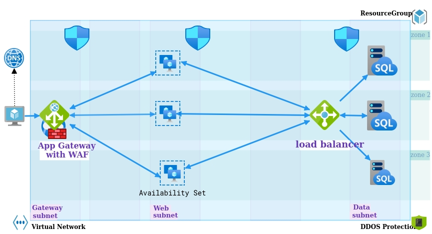

**Solution Requirements:**

Using Terraform and a combination of tools of your choice, create as a GitHub repository and use Infrastructure as Code to create a solution for the specifics detailed below.

1. Create the infrastructure for a classic highly available website architecture with front end web servers and a managed SQL database for the back end.
2. Demonstrate scaling up of the front end webservers using a gitops workflow.
3. Create a Packer script or similar tool to configure a windows webserver golden image build.
4. Show in your code a redeployment using new images using a gitops workflow.

**BONUS POINTS:**
1. In your README.md detail the security aspects that must be considered in the architecture and pipelines.
2. How would you validate your website service is up?
3. Serve your own Hello World page
4. In three to four months we may have an auditor reviewing your work. How would you take this into account?
_______________________________________________________________________________________________________________________________________________________________________________

**Highly Available Web App Design**

**Azure Services**
Web App Gateway