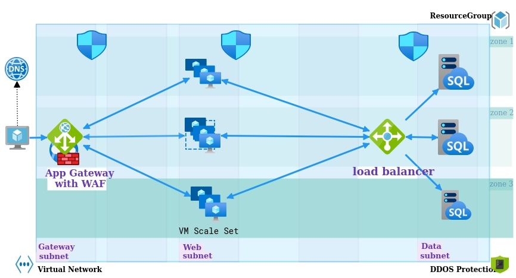

**Solution Requirements:**

Using Terraform and a combination of tools of your choice, create as a GitHub repository and use Infrastructure as Code to create a solution for the specifics detailed below.

1. Create the infrastructure for a classic highly available website architecture with front end web servers and a managed SQL database for the back end.
2. Demonstrate scaling up of the front end webservers using a gitops workflow.
3. Create a Packer script or similar tool to configure a windows webserver golden image build.
4. Show in your code a redeployment using new images using a gitops workflow.

**BONUS POINTS:**
1. In your README.md detail the security aspects that must be considered in the architecture and pipelines.
2. How would you validate your website service is up?
3. Serve your own Hello World page
4. In three to four months we may have an auditor reviewing your work. How would you take this into account?
_______________________________________________________________________________________________________________________________________________________________________________

**Highly Available Web App Design**

Below listed standard design principles considered for this solution

```<language>
Security
Performance & Scalability
Availability & recoverability (Reliability)
Cost optimisation
Operations efficiency

```



**Azure Services**:

- [ ]  App Gateway with WAF (SKU v2)
- [ ]  Public IP Address
- [ ]  VM Scale Set
- [ ]  Layer 4 (Network) Load Balancer for SQL DB
- [ ]  SQL Managed Instance
- [ ]  Network Security Groups
- [ ]  DDOS Protection - Standard
- [ ]  Workloads replicated across Azure zones for HA


 **Design Considerations**

App Gateway with WAF:
- Load balances at traffic at application layer
- Zone redundant service that best meets the solution requirement
- SSL Off loading
- Protects the web app from attacks using the WAF service
- Cookie affinity
- URL based routes
- HTTP headers rewrite support
- Fully managed, highly scalable and available service with security via WAF.

Alternative services:

Azure Front door and Traffic Manager services provide global scale load balancing across Azure regions.
Based on the information provided in the requirements it appears that N-Tier web application does not require global scale load balancing, so the Application Gateway with WAF service chosen.

Refer to the [Decision tree for load balancing in Azure ](https://docs.microsoft.com/en-us/azure/architecture/guide/technology-choices/load-balancing-overview#decision-tree-for-load-balancing-in-azure)
___________________________________________________________________________________________________________________________________________________________________________
