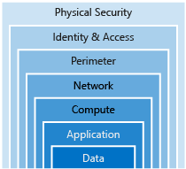

**Solution Requirements:**

Using Terraform and a combination of tools of your choice, create as a GitHub repository and use Infrastructure as Code to create a solution for the specifics detailed below.

1. Create the infrastructure for a classic highly available website architecture with front end web servers and a managed SQL database for the back end.
2. Demonstrate scaling up of the front end webservers using a gitops workflow.
3. Create a Packer script or similar tool to configure a windows webserver golden image build.
4. Show in your code a redeployment using new images using a gitops workflow.

**BONUS POINTS:**
1. In your README.md detail the security aspects that must be considered in the architecture and pipelines.
2. How would you validate your website service is up?
3. Serve your own Hello World page
4. In three to four months we may have an auditor reviewing your work. How would you take this into account?
_______________________________________________________________________________________________________________________________________________________________________________

**Highly Available Web App Design**

Below listed standard design principles considered for this solution

```<language>
Security
Performance & Scalability
Availability & recoverability (Reliability)
Cost optimisation
Operations efficiency

```


**Azure Services**:

- [ ]  App Gateway with WAF (SKU v2)
- [ ]  Public IP Address
- [ ]  VM Scale Set
- [ ]  Layer 4 (Network) Load Balancer for SQL DB
- [ ]  SQL Managed Instance
- [ ]  Network Security Groups
- [ ]  DDOS Protection - Standard
- [ ]  Application Insights
- [ ]  Workloads replicated across Azure zones for HA

**Tools**
- Web based tool app.cloudskew.com used for creating the design diagram
- Visual Studio Code for writing, testing, and deploying the source code
- Azure DevOps for CI/CD Pipeline
- Windows PowerShell ISE to build and deploy Packer gold Image
- Git Hub to store source Code
- Markdown Editor to formate README.md via Visual Studio

> Note that source code is accessible from the above folders, i.e. AzurePipelines, Packer, Terraform and WebApp on this page.

 **Design Considerations**

App Gateway with WAF:
- Load balances traffic at application layer
- Zone redundant service that best meets the solution requirement
- SSL Off loading
- Protects the web app from attacks using the WAF service
- Cookie affinity
- URL based routes
- HTTP headers rewrite support
- Fully managed, highly scalable and available service with security via WAF.

Alternative services:

Azure Front door and Traffic Manager services provide global scale load balancing across Azure regions.
Based on the information provided in the requirements it appears that N-Tier web application does not require global scale load balancing, so the Application Gateway with WAF service chosen.

Refer to the [Decision tree for load balancing in Azure ](https://docs.microsoft.com/en-us/azure/architecture/guide/technology-choices/load-balancing-overview#decision-tree-for-load-balancing-in-azure)

Azure Virtual Machine Scale Set

- Fully managed PaaS service with no management/operational overhead
- Rule based autoscaling in real time (on demand)
- Zone redundancy and native HA support
- Custom VM image to provision VM instances supported

Alternative services:

- VMs could be created and deployed in an availability sets across Azure zones to meet High availability requirement, but no native
- autoscaling features available.
- Custom image to create VMs is not supported
- VMs Management and operational costs

As the VM Scale set meets all the solution requirements and design principles, this service is chosen.

Refer to [Choose an Azure Compute Service for your application](https://docs.microsoft.com/en-us/azure/architecture/guide/technology-choices/compute-decision-tree#choose-a-candidate-service)

Azure SQL Managed Instance

- Fully Managed service
- Auto scaling is natively provided
- Automated backups
- No management and operational cost

As the solution requirement already instructs to use the SQL Managed Instance and the PaaS service meets core design principles
SQL Managed instance service is selected and utilised in the solution.

Refer to [Azure SQL Managed Instance Faqs](https://docs.microsoft.com/en-us/azure/azure-sql/managed-instance/frequently-asked-questions-faq) for more info 

Azure App Insights

- An extensible Application Performance Management (APM) service to monitor applications. 
- Automatically detects performance anomalies, and includes powerful analytics tools to help diagnose issues and to understand the web application usage. 
- Designed to help you continuously improve performance and usability
- Also detects malicious attacks to take necessary remediation and improve security posture

As the Application Insights service is a feature available within Azure Monitor, natively supports the web application with insights and
supports various tools and technologies integration it is selected and utilised in this solution.

Terraform

- A tool for creating, changing, and versioning infrastructure with higher safety and efficiency via automation.
- In-built graphing features for visualization of infrastructure
- Supports multi cloud deployment and development of multi-tier applications 
- Provides the ability for understanding resource relationships
- Capability for breaking down a configuration into smaller parts for ease of source organization and maintenance
- Integrates with wide variety of tools in the DevOps i.e., Azure DevOps, GitHub and Visual Studio.

Alternatives:
- Azure Resource Manager Templates
- Vagrant
- Red Hat Ansible Automation Platform
- AWS CloudFormation

Terraform is widely adopted Open Source Project with great community that meets the IaC and automation requirements.
Azure native ARM templates are difficult to troubleshoot and they do not provide all the Terraform features.
So Terraform is selected and utilised in this solution.

Refer to Terraform documenation [here](https://www.terraform.io/docs/index.html)

Packer
- Builds automated VM images
- Multi cloud support
- Free open source tool
- Integrates with Azure and DevOps pipelines 

As the solution requirements already instructed to use and the tool meets all the technical requiements
it has been selected and used in this solution.

Refer to Packer documentation [here](https://www.packer.io/docs)


GitHub
- Free community supported source code repository
- There are advanced features available in paid plans.
- Workflows automates process made up of one or more jobs
- Integrates with Visual Studio and DevOps 
- Source code Version control provided

Alternatives
- Azure Repos
- Git
- SVN

As the solution requirements instructs to use GitHub and meets all the requiements, GitHub has been utilised
to store the source code and provide documentation (via README.md).

Refer to [GitHub](https://github.com/) portal for more info
_____________________________________________________________________________________________________________________________________________________________________________

**Security** 

security aspects that must be considered in the architecture and pipelines

Use defence in depth strategy to defence against malicious attacks across various layers of the solution as shown below

This approach removes reliance on any single layer of protection. It also acts to slow down an attack and provide alert telemetry that can be acted upon, either automatically or manually.



Identity and access Management
- MFA
- Conditional Access
- RBACS
- Managed Identities
- Privileged Identity Management (PIM)
- Azure AD Identity protection

Infrastructure and Network
- Azure Application Gateway
- Azure DDoS Protection Standard
- Web Application firewall
- Azure Firewall
- Azure Key Vault for storing credentials, certs and secrets
- Azure Defender
- Network micro-segmentation via subnets
- Azure Private Link and private service endpoints
- Use Service Endpoint to restrict traffic between Azure services within Azure backbone network.

Data and Application
- Web Application Firewall
- Adopt DevSecOps - automate end-to-end security scanning via automation. use Checkmarx and OWASAP
- Source code testing - SAST & DAST
- Azure Defender for SQL to perform scheduled assessments and resolve 
- Azure Policies and audit logging
- Azure monitor logs and metrics


Encryption
- Encryption at rest via SQL Transparent data encryption (enabled by default)
- Encryption in transit
- Encryption for data in use using the client side tools (Visual Studio)
- Identify and classify data
- Encrypt VM disks to secure sensitive data
_____________________________________________________________________________________________________________________________________________________________________________
**Auditor Review**

Below listed are the key areas to concentrate and improve the current state of the solution

Security
- Use Azure Security center and improve secure score
- Automate monitoring via alerts and resolve non-complaint services
- Enable logging for all Azure services and store logs in Azure storage account or Event Hub for long time retention.
- Enable Microsoft Security Baselines as the default policy within Security center to improve security posture.

Regulations Compliance
- GDPR Compliance 
- Data residency requirements
- Personal Data Protection 
- PCI-DSS

Others
- Review Infrastructure Design
- Source code Review (DAST and SAST)
- Use credential scanner and move credentials to Azure Key Vault
- Review identity reports and resolve any isssues using the Azure AD Identity reports. 
- Review Azure Policies and deploy relevant built-in or custom guardrails


 